# Hermes debugger problems

Hello, we are the development team of VS Code extension for debugging React Native apps ([vscode-react-native](https://github.com/microsoft/vscode-react-native)). Now we are working on the prototype of React Native Hermes debugger and we've faced several problems of using vscode-chrome-debug-core lib. We think that the problems might be on vscode-chrome-debug-core side, because our implementation extends chromeDebugAdapter without significant structural changes. There are also some issues with React Native Hermes debugging in Chrome itself. Could you please look through the list of problems that we faced with?

Table of problems consists of two columns: first one illustrates the problem when debugging the app with Hermes enabled using prototype of the debugger in the extension, second one - when Chrome is used for debugging the app. Also, there are logs attached for each problem.

Here is a link for sources of the direct debugger: https://github.com/RedMickey/vscode-react-native/tree/react-native-direct-debugger2/src/debugger/direct

## The list of problems

1) The debugger doesn’t show Global, Closure variables. The debugger provides only Local variables (function scope). Google Chrome displays Global variables, but Locals aren't shown.

  |Debugging using VS Code RNT Hermes debugger prototype|Debugging using Chrome|
  |---|---|
  |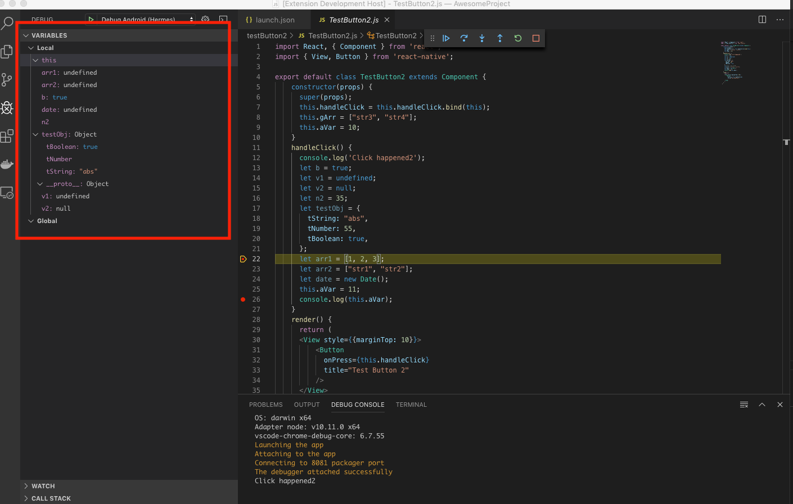|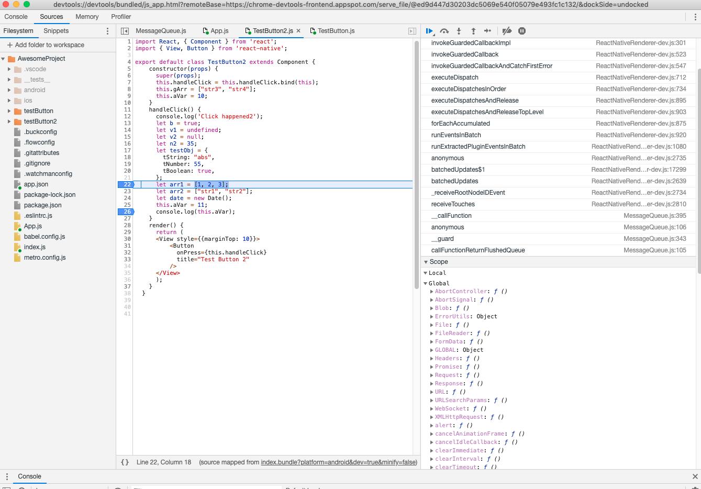|

2) The debugger doesn’t show value of numeric variables.

  |Debugging using VS Code RNT Hermes debugger prototype|Debugging using Chrome|
  |---|---|
  |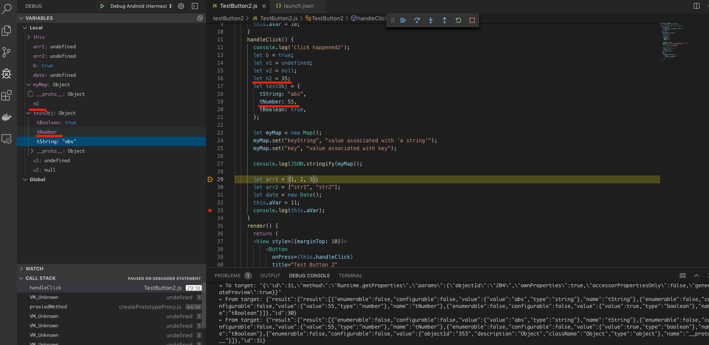|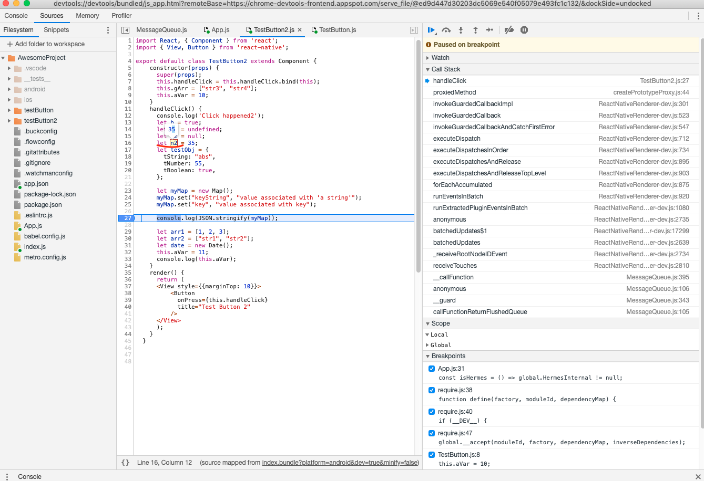|

3) The debugger shows additional VM_unknown calls in Call Stack.
   The debugger displays all the calls as well as Google Chrome, but also adds unknown calls.

  |Debugging using VS Code RNT Hermes debugger prototype|Debugging using Chrome|
  |---|---|
  |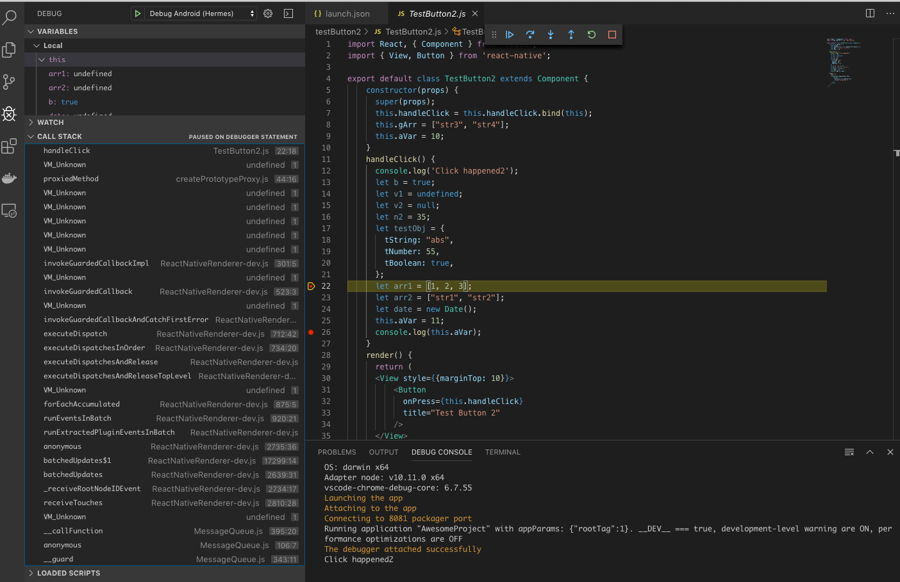|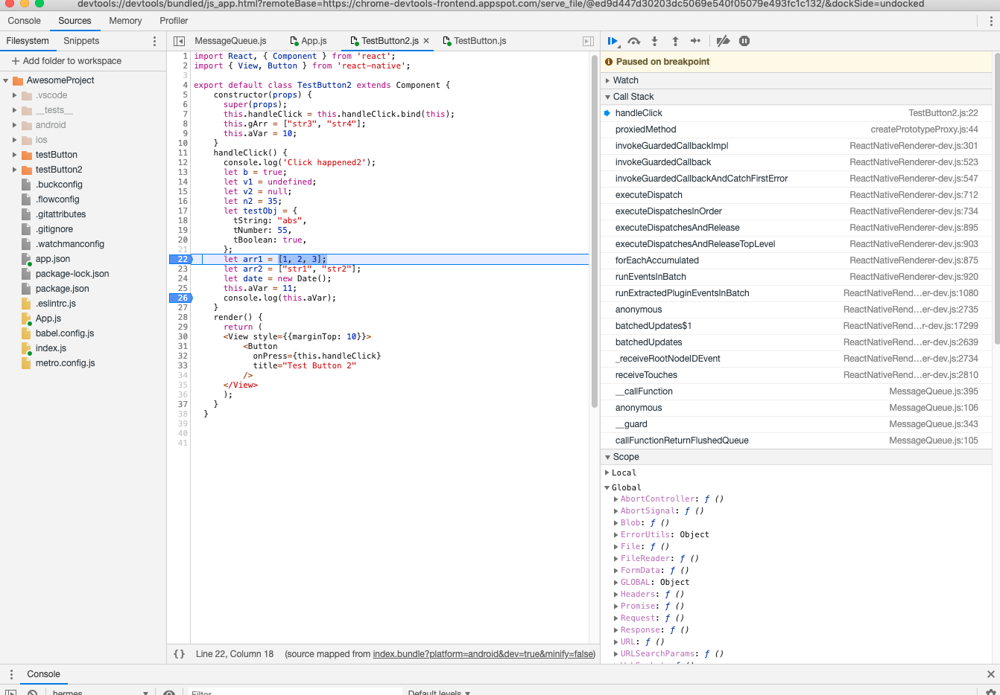|

  [Logs](./logs/appLogs123.txt) for problems 1, 2, 3.

4) The debugger doesn’t provide complete object data (For example, Date object, Map object - there is only an object name without internal data).
    If an object contains an array the debugger doesn't display the object's data.
    Google Chrome displays some objects correctly, but not all (e.g. Map object).
   The debugger doesn’t provide properties containing in “this” object.

  |Debugging using VS Code RNT Hermes debugger prototype|Debugging using Chrome|
  |---|---|
  |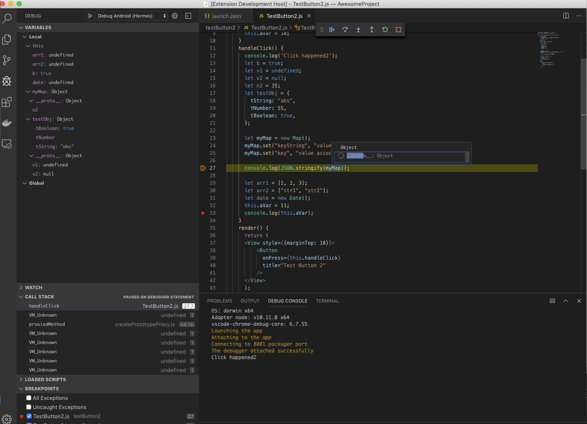|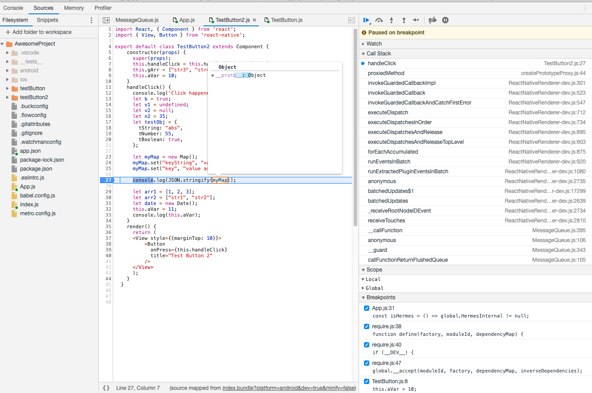|
  |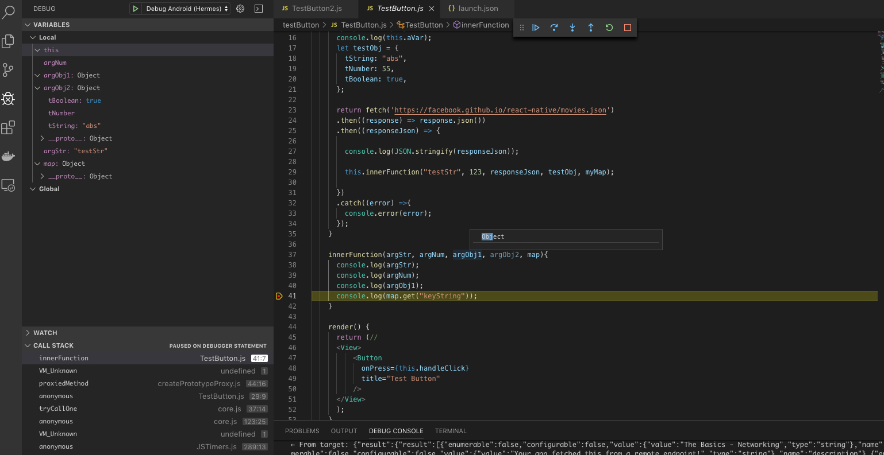|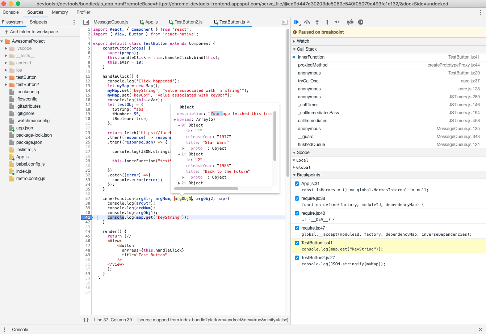|

  [Logs](./logs/appLogs4-1.txt) for problem 4 - 1 table row.
   [Logs](./logs/appLogs4-2.txt) for problem 4 - 2 table row.

5) The debugger doesn’t show local variables, if there is any array definition in a handler function.
   The debugger remove local variables data only when it comes an array definition. Google Chrome displays array's data.

  |Debugging using VS Code RNT Hermes debugger prototype|Debugging using Chrome|
  |---|---|
  |Before the array definition:  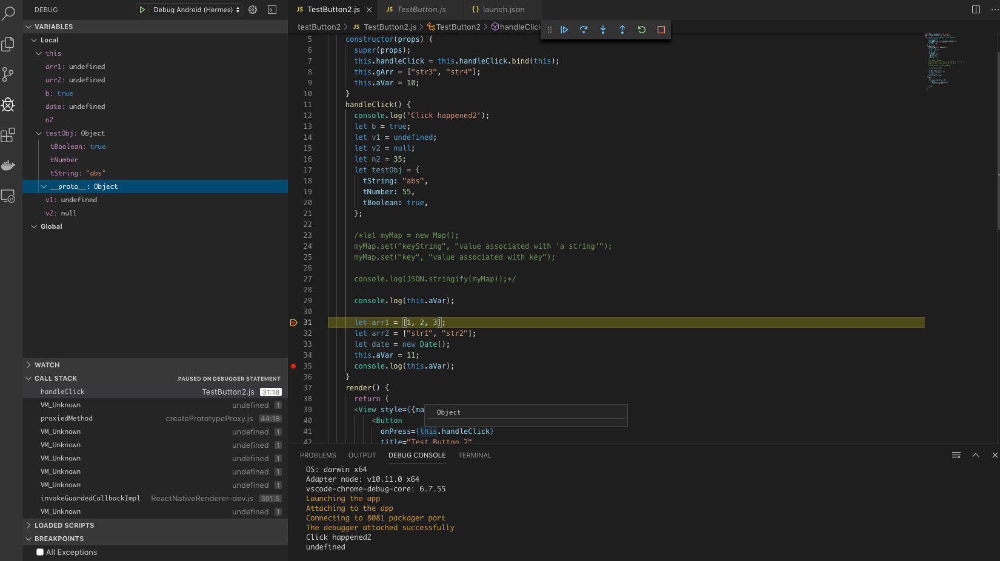|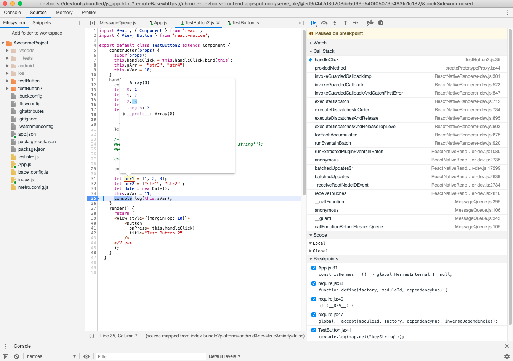|
  |After the array definition:  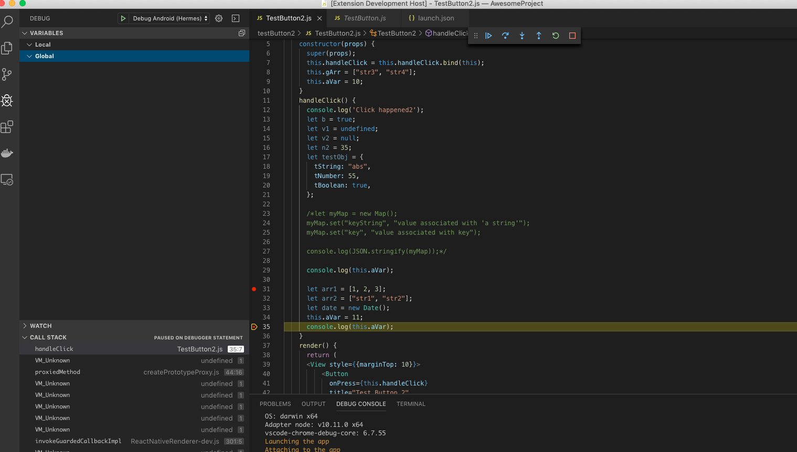||

  [Logs](./logs/appLogs5.txt) for problem 5.