# Telemetry description

## Node Debugger telemetry and Direct Debugger telemetry comparison

  |Node Debugger telemetry events|Direct Debugger telemetry events|
  |---|---|
  | - useProgramProperty| - removed|
  | - useCwdProperty| - removed|
  |Consists of 5 steps: initialStep, startPackager, prewarmBundleCache, mobilePlatform.runApp, mobilePlatform.enableJSDebuggingMode. Each step is independent telemetry object that measures its completion time (in form <eventname>.time) and may contain additional properties such as errors etc.| - launch  We added the special new launch event to separate the launch of Direct debugger from default app launch. All default telemetry steps are similar to Node Debugger case and all parameters remained the same.  added property `isDirect` 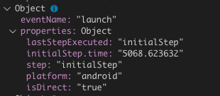|
  | - attach default ChromeDebugAdapter event 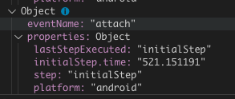|  - attach added property `isDirect` 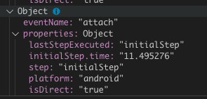|
  | - launch.initialStep |  - launch.initialStep added property `isDirect` 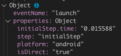|
  | - launch.checkPlatformCompatibility 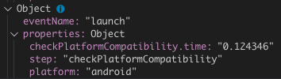|  - launch.checkPlatformCompatibility added property `isDirect` 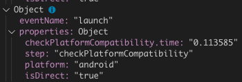|
  | - launch.startPackager 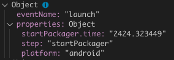|  - launch.startPackager added property `isDirect` 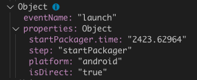|
  | - launch.prewarmBundleCache 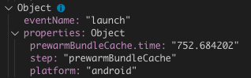|  - launch.prewarmBundleCache added property `isDirect` 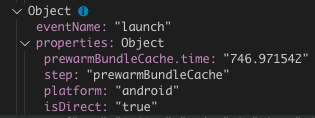|
  | - AndroidPlatform.runApp 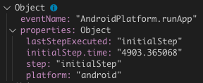|  - AndroidPlatform.runApp added property `isDirect` 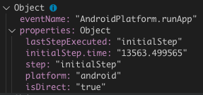|
  | - launch.mobilePlatform.runApp 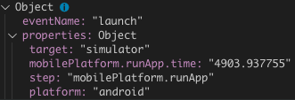|  - launch.mobilePlatform.runApp added property `isDirect` 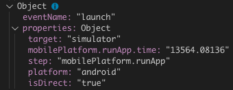|
  | - mobilePlatform.enableJSDebuggingMode the step for NodeDebugAdapter in `launch` app telemetry sequence 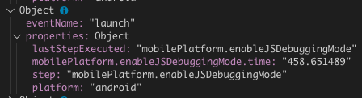|  - mobilePlatform.enableDirectDebuggingMode added the step `mobilePlatform.enableDirectDebuggingMode` in `launch` app telemetry sequence instead of `mobilePlatform.enableJSDebuggingMode` 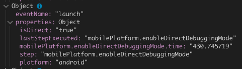|

## Telemetry launch extension error events

 - ActivateCouldNotFindWorkspace
    Emits if a user tries to start the debugger without opening React Native project folder or workspace. This event contains error code number 802 - `CouldNotFindWorkspace`.
    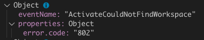

 - AddProjectReactNativeVersionIsEmpty
    Emits if a user opened a folder which doesn't contain React Native project or React Native project version and tries to start the debugger. This event contains error code number 605 - `CouldNotFindProjectVersion`.
    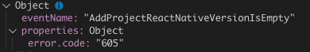
